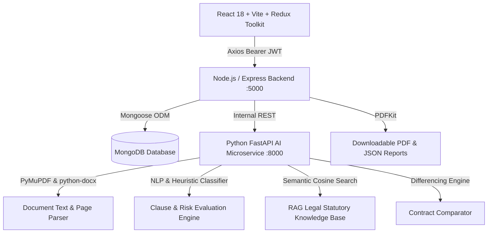

# ClauseIQ v1.0.0 — Production AI Contract Intelligence Platform


> **ClauseIQ** is an enterprise-grade AI-powered contract intelligence platform built to parse, segment, audit, and remediate complex legal agreements. It replaces dense legalese with plain English, calculates calibrated risk scores, detects one-sided clauses, matches statutory benchmarks via RAG, enables side-by-side contract diffing, and generates executive compliance reports.

---

## 🏛️ System Architecture



---

## 🚀 Key Features

1. **Authentication & Role-Based Access Control**:
   - Secure JWT token authentication with bcrypt password hashing.
   - Glassmorphic login and registration interfaces.
2. **Contract Ingestion Pipeline**:
   - Multi-format support: PDF (`.pdf`), Microsoft Word (`.docx`), and Plain Text (`.txt`).
   - PyMuPDF text extraction with layout retention and page-level metadata.
3. **AI Clause Detection & Risk Scoring**:
   - Automated segmentation across 9+ legal categories: Termination, Non-Compete, Auto-Renewal, Indemnity, Payment Terms, Confidentiality, IP Rights, Arbitration, and Force Majeure.
   - Plain English translations, real-world liability examples, and negotiation advice.
4. **Retrieval-Augmented Generation (RAG) Statutory Knowledge Base**:
   - Matches flagged clauses against statutory references (Indian Contract Act 1872 Section 27, IT Act 2000 Section 72A, Consumer Protection Act 2019, Arbitration Act 1996, and Labour Codes).
5. **Interactive Legal Chat Assistant**:
   - Context-grounded contract Q&A chatbot with automatic statutory citation bubbles.
6. **Side-by-Side Contract Comparison**:
   - Compares Baseline vs Counterparty contract drafts, isolating Added, Removed, and Modified provisions with calculated Risk Delta.
7. **Compliance Report Generator**:
   - One-click executive PDF report generation and structured JSON exports.

---

## 👥 Team Distribution (MyAnatomy Sandbox Pro)

| Member | Responsibilities |
|---|---|
| **Pradeep** | Milestone 1, 2, 3, 14, 15 (Authentication, Redux Store, Integration, Testing, Deployment) |
| **Mehak** | Milestone 4, 5, 11 (Upload, Contract CRUD, Comparison Engine) |
| **Princi** | Milestone 6, 7, 8, 10 (PDF Parsing, Clause Detection, RAG, AI Chat) |
| **Ragni** | Milestone 3, 9, 12, 13 (Dashboard, Reports, Charts, Notifications) |

---

## 🛠️ Quickstart Installation

### 1. Install Dependencies
```bash
# In backend
cd backEnd && npm install

# In frontend
cd ../frontEnd && npm install

# In AI Service (Python requirements)
cd ../ai-service && pip install -r requirements.txt
```

### 2. Seed Database with Demo Contracts
```bash
npm run seed
```
> Populates sample contracts (Employment Agreement, SaaS MSA, Mutual NDA) and demo account:
> - **Email**: `demo@clauseiq.ai`
> - **Password**: `password123`

### 3. Run Development Servers
```bash
# Concurrently start Frontend (:5173), Backend (:5000), and AI Service (:8000):
npm run dev
```

---

## 📂 Project Structure

```
ClauseIQ/
├── frontEnd/                 # React 18 + Vite + Redux Toolkit + Tailwind CSS
│   └── src/
│       ├── redux/            # authSlice, contractSlice, aiSlice, reportSlice, store.js
│       ├── pages/            # Dashboard, Upload, Contracts, Analysis, Compare, Chat, Reports
│       ├── components/       # layouts, common, dashboard, upload, analysis, chat, compare
│       └── services/         # Axios API client with Bearer interceptors
│
├── backEnd/                  # Node.js + Express + MongoDB REST API (/api/v1)
│   ├── config/               # db.js (MongoDB Connection)
│   ├── controllers/          # auth, contract, ai, report, notification, history
│   ├── middleware/           # auth, upload, error, validation
│   ├── models/               # User, Contract, Analysis, Notification, History
│   ├── routes/v1/            # Versioned API routes
│   └── services/             # aiClient bridge & PDFKit report generator
│
├── ai-service/               # Python FastAPI Microservice (:8000)
│   ├── parser/               # extractor.py (PyMuPDF & docx)
│   ├── services/             # clause_detector.py, comparator.py, chat_assistant.py
│   ├── rag/                  # knowledge_base.py (Statutory Corpus & Vector Search)
│   └── main.py               # FastAPI App
│
└── sample-contracts/         # Real test agreements (Employment, SaaS, NDA)
```

---

## 🧪 Testing

Run backend integration test suite:
```bash
npm run test
```
Verifies health, authentication, profile security, contract retrieval, notifications, and AI chat.
